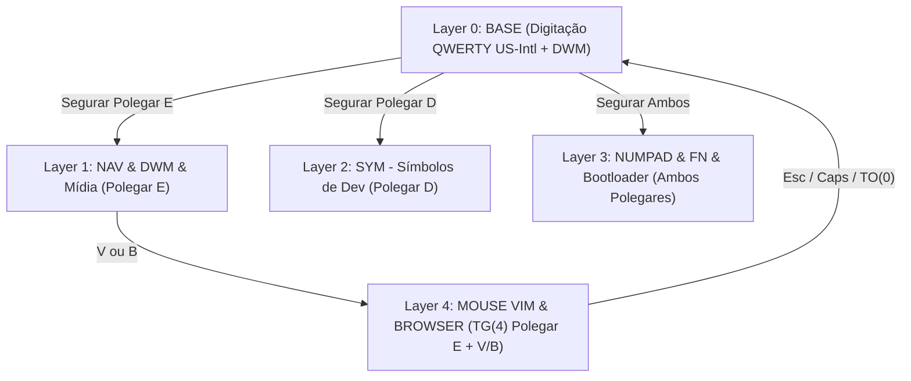

# Guia Definitivo de Estudos: Biomecânica, Ciência Ergonômica e Arquitetura do Silakka54

Este documento reúne a base teórica, as pesquisas científicas e a experiência prática da comunidade mundial de desenvolvedores que fundamentaram todas as decisões de design adotadas no seu **Silakka54 (54 teclas, split, RP2040, Vial)**.

---

## 📑 Sumário Executivo

1. [O Problema dos Teclados Tradicionais (A Herança de 1873)](#1-o-problema-dos-teclados-tradicionais-a-herança-de-1873)
2. [Evidências Científicas e Biomecânica Ocupacional](#2-evidências-científicas-e-biomecânica-ocupacional)
   * Desvio Ulnar e Extensão de Punho
   * Pronação do Antebraço e o Efeito *Tenting*
   * A Lei de Fitts e o Princípio da *Home Row*
   * Biomecânica e Distribuição de Força dos Dedos
   * O Custo Oculto do *Mouse Reach* (Alcance do Mouse)
3. [Linguística Computacional e Digitação em Português & Código](#3-linguística-computacional-e-digitação-em-português--código)
   * Alternância entre Mãos (*Hand Alternation*) vs *Same-Finger Bigrams* (SFBs)
   * A Solução do Cedilha (`ç`) e Acentuação: *Dead Keys* vs *Tap-Dance*
   * Otimização de Símbolos de Programação (`=`, `+`, `-`, `( )`, `{ }`)
4. [A Arquitetura de Camadas do Silakka54 (O Que Foi Construído)](#4-a-arquitetura-de-camadas-do-silakka54-o-que-foi-construído)
5. [Comparativo com Grandes Padrões Mundiais (Miryoku, Seniply, Callum)](#5-comparativo-com-grandes-padrões-mundiais-miryoku-seniply-callum)
6. [Referências Bibliográficas e Artigos Científicos Recomendados](#6-referências-bibliográficas-e-artigos-científicos-recomendados)

---

## 1. O Problema dos Teclados Tradicionais (A Herança de 1873)

Quase todos os teclados convencionais de computador (incluindo o layout de notebooks e teclados padrão 100%, TKL e 60%) são baseados na máquina de escrever mecânica desenvolvida por **Christopher Latham Sholes em 1873**:

1. **Colunas em Escada (*Staggered Columns*)**: As teclas não são alinhadas verticalmente porque as hastes de ferro mecânicas precisavam de espaço físico para não se cruzarem e travarem. Suas mãos não são assimétricas em degraus — seus dedos flexionam em linhas retas.
2. **Barra de Espaço Gigante**: Ocupa o equivalente a 5 ou 6 teclas, sendo operada por dois polegares (os membros mais fortes da mão), desperdiçando 90% do seu potencial funcional em apenas um caractere.
3. **Sobrecarga Extrema do Dedo Mindinho (*Pinky Strain*)**: O dedo mais fraco e anatomicamente desfavorecido é responsável por `Enter`, `Backspace`, `Shift`, `Ctrl`, `Tab`, `CapsLock` e dezenas de colchetes e barras.
4. **Postura Bloqueada**: Obriga o usuário a juntar os braços, fechar o peito e dobrar os punhos para fora para que as mãos caibam juntas em uma única prancha retangular.

---

## 2. Evidências Científicas e Biomecânica Ocupacional

### A. Desvio Ulnar e Pressão no Túnel do Carpo
* **O que é**: Quando você digita em um teclado comum reto, seus punhos são dobrados para fora em direção ao dedo mindinho para que os dedos fiquem paralelos às teclas.
* **A evidência científica**: 
  * Pesquisas de **Rempel et al. (2007)** e **Simoneau & Marklin (1999)** mediram diretamente a pressão dentro do canal do túnel do carpo (*Carpal Tunnel Pressure - CTP*) durante a digitação.
  * O estudo comprovou que manter um desvio ulnar acima de 15° eleva a pressão intracanal para mais de **30 mmHg** (nível crítico associado à isquemia do nervo mediano e lesão por esforço repetitivo - LER/DORT).
* **Solução no Silakka54**: Sendo um teclado **dividido (*split*)**, você posiciona cada metade alinhada exatamente com a largura dos seus ombros, mantendo o punho perfeitamente reto (desvio 0°).

```text
TECLADO COMUM (Reto):             SILAKKA54 (Dividido):
  Ombro E       Ombro D             Ombro E       Ombro D
     \             /                   |             |
      \           /                    |             |
     [Punho Dobrado]             [Punho 100% Reto] [Punho 100% Reto]
       (Desvio Ulnar)                 (Neutro)          (Neutro)
```

---

### B. Pronação do Antebraço e Tenting
* **O que é**: No teclado comum, as palmas das mãos ficam 100% viradas para baixo (paralelas à mesa). Isso causa pronação forçada dos ossos rádio e ulna.
* **A evidência científica**: **Marklin et al. (1999)** demonstraram que uma leve inclinação lateral (*tenting* de 10° a 20°) relaxa os músculos pronador redondo e pronador quadrado, reduzindo a fadiga miofascial nos antebraços e ombros.
* **Aplicação**: O gabinete do Silakka54 permite o uso de pés de apoio com elevação central (*tenting*).

---

### C. A Lei de Fitts (*Fitts's Law*, 1954) e a *Home Row*
* **A Lei**: O tempo necessário para mover rapidamente um membro (ou dedo) até um alvo é uma função logarítmica da **distância até o alvo** e da **largura do alvo**:
  $$\text{MT} = a + b \log_2 \left( \frac{2D}{W} \right)$$
  *(Onde $D$ é a distância e $W$ é a largura da tecla).*
* **O que isso significa na digitação**:
  * Alcançar teclas distantes (como a linha de números, símbolos no topo ou as setas convencionais) consome até **3x a 5x mais tempo** e aumenta drasticamente a taxa de erro.
  * **Princípio da Home Row**: No Silakka54, em vez de seu dedo viajar até a tecla, a tecla é trazida até o dedo por meio de **camadas (*layers*) acionadas pelos polegares**. Seus dedos quase nunca saem da linha de descanso.

---

### D. Distribuição de Força dos Dedos
Estudos de força manual e preensão (*grip/pinch strength*) mostram a seguinte hierarquia anatômica:

| Dedo | Musculatura Principal | Resistência à Fadiga | No Teclado Comum | No Silakka54 |
| :--- | :--- | :--- | :--- | :--- |
| **Polegar** | Eminência Tenar (músculos próprios e independentes) | **Altíssima** | Desperdiçado (só Espaço) | **Super (DWM), Layers, Espaço, Enter, AltGr** |
| **Indicador** | Flexores e lumbricais fortes | Alta | Muitas letras centrais | Operadores matemáticos e navegação |
| **Médio** | Dedo mais longo e estável | Alta | Teclas centrais | Caracteres de código centrais |
| **Anelar** | Compartilha tendões com médio e mínimo | Moderada | Digitação | Digitação normal |
| **Mínimo (Mindinho)** | Menor secção transversal muscular | **Muito Baixa (Frágil)** | **Sobrecarregado com modificadores e Enter/Bksp** | **Aliviado**: Teclas pesadas foram para os polegares! |

---

### E. O Custo Oculto do *Mouse Reach*
* Toda vez que você retira a mão do teclado para segurar o mouse:
  1. O braço realiza **abdução e rotação externa do ombro** (sobrecarregando o músculo trapézio e o manguito rotador).
  2. Perde-se a referência tátil da linha de descanso (*homing bumps* no F e J).
  3. Ocorre uma micro-interrupção cognitiva (*context switch motor*).
* **Solução no Silakka54**: A **Layer 4 (Modo Mouse Vim)** permite guiar o cursor com `HJKL`, dar cliques com a mão esquerda e polegares, rolar páginas e navegar na web (`Z`/`X`) **sem tirar as mãos do teclado**.

---

## 3. Linguística Computacional e Digitação em Português & Código

### A. Alternância de Mãos (*Hand Alternation*)
* Em teclados otimizados, busca-se maximizar a alternância de mãos: enquanto a mão direita pressiona uma tecla, a mão esquerda já está se posicionando para a próxima.
* **No Português**:
  * No padrão **US-International**, para fazer `ç`, `á`, `é`, `ó`:
    * Mão Direita aperta o acento `'` (na Home Row, ao lado do `;`).
    * Mão Esquerda aperta `c` ou a vogal `a`.
  * Essa alternância entre mãos é muito mais fluida e causa menos estresse do que repetir toques sequenciais no mesmo dedo da mesma mão (*Same-Finger Bigrams - SFBs*).

### B. Por Que Não Usar *Tap-Dance* no `C` para Fazer `Ç`?
Muitos iniciantes pensam: *"Por que não colocar dois toques rápidos no C para sair ç?"*
A comunidade de desenvolvedores já testou e quase todos abandonaram essa ideia por dois motivos técnicos:
1. **Colisão com Palavras em Inglês e Código**: Em linguagens de programação e na documentação técnica, palavras com `cc` duplo são onipresentes:
   * `access`, `accept`, `account`, `success`, `succinct`, classes CSS `.account-container`.
   * Com o Tap-Dance no `C`, a digitação rápida dessas palavras dispara acidentalmente `açept` ou `suçess`.
2. **Latência de Tecla (*Tapping Term*)**: O firmware precisa aguardar de 150ms a 200ms após o primeiro toque para "decidir" se você vai apertar a segunda vez ou não, causando um micro-atraso perceptível.
* **Solução Ideal**: Usar o `'` + `c` (natural) ou o atalho nativo do polegar **`AltGr + ,`**.

### C. Otimização de Símbolos para Desenvolvedores
No Silakka54, os símbolos de programação foram agrupados na **Layer 2 (Polegar Direito)**:
* **Símbolos Pareados Lado a Lado**:
  * Parênteses: `(` e `)` nos dedos médio e anelar da mão esquerda.
  * Chaves: `{` e `}` lado a lado.
  * Colchetes: `[` e `]` lado a lado.
  * Menor/Maior: `<` e `>` lado a lado.
* **Operadores na Home Row**:
  * Em vez de esticar a mão para a linha de números com Shift, os operadores `=`, `+`, `-`, `*`, `/` estão localizados exatamente sob a posição de repouso dos seus dedos na mão direita (`H, J, K, L, ;`).

---

## 4. A Arquitetura de Camadas do Silakka54



### Resumo das 5 Camadas:
1. **Layer 0 (Base)**:
   * QWERTY com foco em acentos rápidos para português (`'` e `` ` `` dedicados).
   * `Super / Mod4` no polegar esquerdo para controle ágil do **DWM** (`Super+Enter`, `Super+D`, etc.).
   * `CapsLock` com papel duplo (*Dual-Role*): Toque rápido = `ESC` (ideal para Vim/LazyVim); Segurado = `CTRL`.
2. **Layer 1 (Navegação & Mídia)**:
   * Setas completas do Vim no repouso: `H` (Esquerda), `J` (Baixo), `K` (Cima), `L` (Direita).
   * Navegação em texto: `U` (Home), `P` (End), `I` (Page Up), `O` (Page Down).
   * Controles de volume, brilho, print screen e multimídia.
3. **Layer 2 (Símbolos de Código)**:
   * Parênteses, chaves e colchetes em pares contíguos na mão esquerda.
   * Operadores matemáticos e igualdade agrupados na linha de repouso da mão direita.
4. **Layer 3 (Numpad & Funções)**:
   * Mão direita vira um teclado numérico clássico de calculadora física (`7 8 9 / 4 5 6 / 1 2 3 / 0 . = Enter`).
   * Mão esquerda ganha as teclas `F1` a `F12`.
   * Tecla de gravação do RP2040 (`⚡ BOOTLOADER`) no canto inferior esquerdo.
5. **Layer 4 (Modo Mouse Vim & Web)**:
   * Controle milimétrico do ponteiro com `HJKL`.
   * Rolagem suave e horizontal.
   * Cliques esquerdo, direito e meio nos polegares e dedos da mão esquerda.
   * Navegação direta no navegador: `Z` (Voltar página), `X` (Avançar página), `C` (Fechar aba), `V` (Nova aba).
   * Modo Sniper (`A` ou `1`) para acertar alvos minúsculos.

---

## 5. Comparativo com Grandes Padrões Mundiais

| Característica | Padrão Miryoku | Padrão Seniply | Silakka54 (Fábio Custom) |
| :--- | :--- | :--- | :--- |
| **Total de Teclas** | 36 teclas ultra-minimalistas | 34 a 42 teclas | **54 teclas (Conforto com números e pontuação)** |
| **Linha Numérica Física** | Inexistente (só via camadas) | Inexistente | **Presente na Layer 0** (Ideal para tags do DWM e números diretos) |
| **Modificadores (Shift/Ctrl)** | *Home Row Mods* (segurar letras) | Camadas nos polegares | **Híbrido sem latência**: Super no polegar, Caps=Esc/Ctrl, Shift nas bordas |
| **Português (US-Intl)** | Não focado (feito para inglês) | Feito para inglês | **100% nativo para Português US-Intl e código** |
| **Mouse Emulation** | Camada própria de mouse | Rara | **Mouse Vim completo com atalhos de browser integrados** |

---

## 6. Referências Bibliográficas e Artigos Científicos Recomendados

Se você quiser se aprofundar na literatura acadêmica e nas pesquisas da comunidade, estes são os estudos fundamentais:

1. **Marklin, R. W., Simoneau, G. G., & Monroe, J. F. (1999)**:  
   *Wrist and forearm posture of users of alternative and standard keyboards.* Human Factors, 41(4), 511-527.  
   *(Demonstra o impacto positivo da divisão do teclado e do tenting na postura do rádio e da ulna).*
2. **Rempel, D., Barr, A., Brafman, D., & Young, E. (2007)**:  
   *The effect of keyboard keyswitch make force on carpal tunnel pressure.* Ergonomics, 50(9), 1488-1498.  
   *(Analisa a relação entre a força das molas/switches e a pressão no nervo mediano).*
3. **Hedge, A., & Powers, J. R. (1995)**:  
   *Wrist postures while keyboarding: effects of a negative slope keyboard system and work surface heights.* Ergonomics, 38(3), 508-522.
4. **Fitts, P. M. (1954)**:  
   *The information capacity of the human motor system in controlling the amplitude of movement.* Journal of Experimental Psychology, 47(6), 381.  
   *(Base teórica que justifica manter todas as teclas essenciais na Home Row).*
5. **Manna Harbour (2021)**:  
   *Miryoku Layout Documentation.* GitHub: [manna-harbour/miryoku](https://github.com/manna-harbour/miryoku).  
   *(A documentação de referência mais influente no mundo sobre ergonomia de camadas compactas).*
6. **Colemak Research Studies**:  
   *Carpal Tunnel Prevention and Effort Metrics.* Colemak.com & Keyboard Ergonomics Lab.  
   *(Comparações estatísticas de distância percorrida pelos dedos entre diferentes layouts).*
